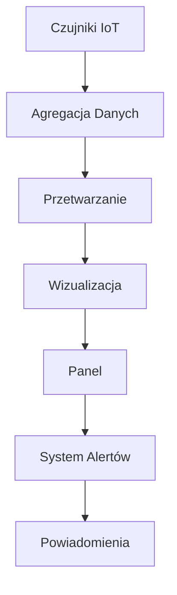
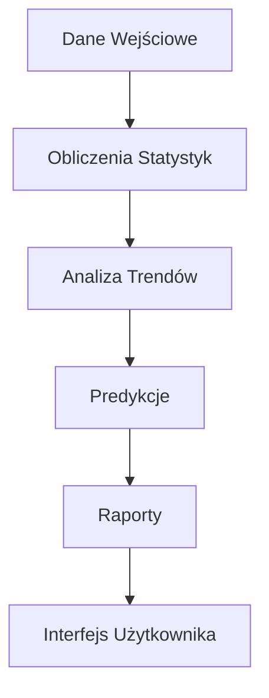
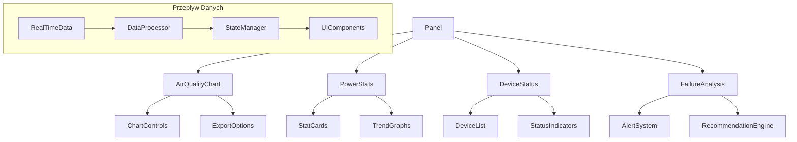

Jasne, oto tłumaczenie na język polski:

# Dokumentacja Architektury Systemu - Panel

## 1. Przegląd Systemu
System implementuje zaawansowany panel do monitorowania jakości powietrza i zarządzania infrastrukturą monitoringu jakości powietrza w czasie rzeczywistym. Główne funkcjonalności obejmują:
- Monitorowanie jakości powietrza w czasie rzeczywistym
- Analiza trendów jakości powietrza
- Status urządzeń IoT i czujników
- System alertów i powiadomień
- Integracja z zewnętrznymi systemami pomiarowymi

## 2. Główne Komponenty

### Monitoring jakości powietrza (`src/components/dashboard/AirQualityChart.tsx`)
- Interaktywne wykresy jakości powietrza
- Możliwość przełączania między różnymi typami wykresów
- System eksportu danych (PDF/JPG)
- Funkcje przybliżania i analizy szczegółowej
- **Punkty dostosowania:**
  ```typescript
  // Kolory wykresu
  <Line stroke="#ef4444" /> // Zmień kolor linii
  
  // Konfiguracja legendy
  <Legend 
    verticalAlign="bottom"
    height={36}
  />
  
  // Dostosowanie tooltipów
  <CustomTooltip />
  ```

### Statystyki Mocy (`src/components/dashboard/PowerStats.tsx`)
- Karty z kluczowymi wskaźnikami
- Animowane wskaźniki statusu
- Wykresy trendów
- **Punkty dostosowania:**
  ```typescript
  // Progi statusów
  const getStatusColor = (value: number) => {
    if (value > 80) return "bg-green-500";
    if (value > 50) return "bg-yellow-500";
    return "bg-red-500";
  };
  ```

### Status Urządzeń (`src/components/network/DeviceStatus.tsx`)
- Monitoring transformatorów
- Status liczników energii
- Parametry czujników
- **Punkty dostosowania:**
  ```typescript
  // Konfiguracja statusów
  const deviceStatuses = {
    online: "bg-green-500",
    warning: "bg-yellow-500",
    error: "bg-red-500"
  };
  ```

### Analiza Awarii (`src/components/network/FailureAnalysis.tsx`)
- System wykrywania problemów
- Rekomendacje naprawcze
- Historia awarii
- **Punkty dostosowania:**
  ```typescript
  // Priorytety alertów
  const priorityLevels = {
    high: { color: "red", icon: AlertTriangle },
    medium: { color: "yellow", icon: AlertCircle },
    low: { color: "blue", icon: Info }
  };
  ```

## 3. Przepływ Danych

### Monitoring w czasie rzeczywistym


### Analiza Wydajności


## 4. Kluczowe Technologie
- **Frontend**: React + TypeScript
  - Komponenty funkcyjne
  - Hooks dla logiki biznesowej
  - TypeScript dla bezpieczeństwa typów
- **Wizualizacja**: Recharts
  - Responsywne wykresy
  - Interaktywne elementy
  - Customizacja stylów
- **UI Framework**: Tailwind CSS + shadcn/ui
  - System projektowania
  - Komponenty wielokrotnego użytku
  - Responsywny układ
- **Animacje**: Framer Motion
  - Płynne przejścia
  - Interaktywne elementy
  - Animacje wykresów
- **Eksport Danych**: 
  - HTML2Canvas dla zrzutów ekranu
  - jsPDF dla dokumentów PDF

## 5. Architektura Danych

### Struktura Danych Czujników
```typescript
interface SensorData {
  id: string;
  type: 'pm25' | 'pm10' | 'ozone' | 'co2';
  value: number;
  unit: string;
  timestamp: Date;
  status: 'normal' | 'warning' | 'error';
}
```

### Format Alertów
```typescript
interface Alert {
  id: string;
  severity: 'low' | 'medium' | 'high';
  message: string;
  timestamp: Date;
  acknowledged: boolean;
  deviceId: string;
}
```

### Dane Historyczne
```typescript
interface HistoricalData {
  period: 'hour' | 'day' | 'week' | 'month';
  data: Array<{
    timestamp: Date;
    value: number;
  }>;
}
```

## 6. Planowane Ulepszenia
1. **Zaawansowana Analityka**
   - Machine Learning dla predykcji awarii
   - Automatyczna optymalizacja zużycia
   - Zaawansowane algorytmy detekcji anomalii

2. **Rozszerzone Możliwości Eksportu**
   - Nowe formaty raportów
   - Customizowane szablony
   - Automatyczne harmonogramy eksportu

3. **Ulepszona Wizualizacja**
   - Nowe typy wykresów
   - Interaktywne dashboardy
   - Widoki 3D dla kompleksowych danych

4. **Integracje**
   - API dla systemów zewnętrznych
   - Integracja z systemami SCADA
   - Wsparcie dla protokołów przemysłowych

5. **Optymalizacja Wydajności**
   - Buforowanie danych
   - Optymalizacja zapytań
   - Progresywne ładowanie danych

## 7. Struktura Komponentów


## 8. Kluczowe Miejsca do Dostosowania

### Dane Firm (`src/data/companies/`)
```typescript
// Przykład modyfikacji danych firmy
export const companyData = {
  id: "1",
  name: "EnergiaPro",
  stats: [
    {
      title: "PM2.5",
      value: 15,
      unit: "µg/m³",
      trend: "down"
    }
  ]
};
```

### Komponenty UI (`src/components/ui/`)
```typescript
// Przykład customizacji komponentu
export const CustomCard = styled(Card)`
  border-radius: 12px;
  box-shadow: 0 4px 6px rgba(0, 0, 0, 0.1);
`;
```

### Tłumaczenia (`src/i18n/translations/`)
```typescript
// Przykład dodania nowych tłumaczeń
export const translations = {
  pl: {
    dashboard: {
      title: "Panel monitorowania",
      stats: "Statystyki",
      alerts: "Alerty"
    }
  }
};
```

### Konfiguracja Wykresów (`src/components/dashboard/`)
```typescript
// Przykład konfiguracji wykresu
const chartConfig = {
  colors: ["#ef4444", "#34d399", "#60a5fa"],
  animations: true,
  tooltip: {
    enabled: true,
    format: "value: {value} {unit}"
  }
};
```

### System Alertów (`src/components/network/`)
```typescript
// Przykład konfiguracji alertów
const alertConfig = {
  thresholds: {
    pm25: { warning: 25, critical: 50 },
    pm10: { warning: 40, critical: 75 },
    ozone: { warning: 70, critical: 120 },
    co2: { warning: 1000, critical: 2000 }
  },
  notifications: {
    email: true,
    push: true,
    sms: false
  }
};
## 9. Asystent AI RAG

Asystent AI wykorzystuje architekturę Retrieval-Augmented Generation (RAG), aby dostarczać użytkownikom inteligentne informacje i odpowiedzi związane z jakością powietrza.

### 9.1. Architektura

Architektura RAG składa się z następujących komponentów:

-   **Dane wejściowe użytkownika:** Użytkownik wprowadza zapytanie dotyczące jakości powietrza, na przykład „Jaka jest jakość powietrza w Gdyni?” Lub „Jakie są skutki zdrowotne PM2.5?”.
-   **Pobieranie:** System wykorzystuje zapytanie użytkownika do pobrania odpowiednich dokumentów z bazy wiedzy. Ta baza wiedzy zawiera informacje o standardach jakości powietrza, zanieczyszczeniach, wpływie na zdrowie i lokalnych przepisach. Katalog `src/utils/rag/` prawdopodobnie zawiera implementację pobierania danych.
-   **Generowanie:** Pobierane dokumenty są łączone z zapytaniem użytkownika i przekazywane do dużego modelu językowego (LLM).
-   **Wyjście:** LLM generuje spójną i informacyjną odpowiedź na zapytanie użytkownika na podstawie pobranej wiedzy.

### 9.2. Kluczowe komponenty

-   `src/components/chat/Chatbot.tsx`: Ten komponent zapewnia interfejs użytkownika do interakcji z Asystentem AI.
-   `src/hooks/useChat.ts`: Ten hook zarządza stanem czatu i obsługuje dane wejściowe użytkownika.
-   `src/utils/rag/`: Ten katalog zawiera logikę pobierania odpowiednich dokumentów z bazy wiedzy.
-   `src/lib/gemini.ts`: Ten plik prawdopodobnie zawiera integrację z Gemini LLM lub innym modelem językowym używanym do generowania odpowiedzi.

## 10. Pomorska Mapa Jakości Powietrza

Pomorska Mapa Jakości Powietrza zapewnia wizualną reprezentację danych dotyczących jakości powietrza w województwie pomorskim.

### 10.1. Cel

Mapa ma na celu:

-   Zapewnienie obywatelom informacji w czasie rzeczywistym o jakości powietrza w ich regionie.
-   Podnoszenie świadomości na temat poziomu zanieczyszczenia powietrza i jego potencjalnego wpływu na zdrowie.
-   Wspieranie podejmowania świadomych decyzji dotyczących aktywności na świeżym powietrzu.

### 10.2. Źródła danych

Mapa integruje dane z różnych źródeł, w tym:

-   **Czujniki IoT:** Sieć czujników rozmieszczonych w całym województwie pomorskim mierzy stężenia zanieczyszczeń.
-   **Airly:** Dane z czujników Airly są zintegrowane, aby zapewnić bardziej kompleksowy obraz jakości powietrza. `src/components/pomerania/AirlyMap.tsx` prawdopodobnie obsługuje integrację z danymi Airly.
-   **Rządowe stacje monitoringu:** Oficjalne dane dotyczące monitoringu jakości powietrza z agencji rządowych są również uwzględniane.

### 10.3. Wizualizacja

Mapa wykorzystuje kolorowe znaczniki i mapy cieplne do reprezentowania poziomów jakości powietrza. Użytkownicy mogą klikać na określone lokalizacje, aby wyświetlić szczegółowe informacje o stężeniach zanieczyszczeń.

### 10.4 Kluczowe komponenty

-   `src/components/pomerania/PomeranianAirQuality.tsx`: Ten komponent jest głównym punktem wejścia dla Pomorskiej Mapy Jakości Powietrza.
-   `src/components/pomerania/AirlyMap.tsx`: Ten komponent wyświetla dane z czujników Airly na mapie.
-   `src/components/map/EnergyMap.tsx`: Ten komponent renderuje mapę i obsługuje interakcje użytkownika.
```
